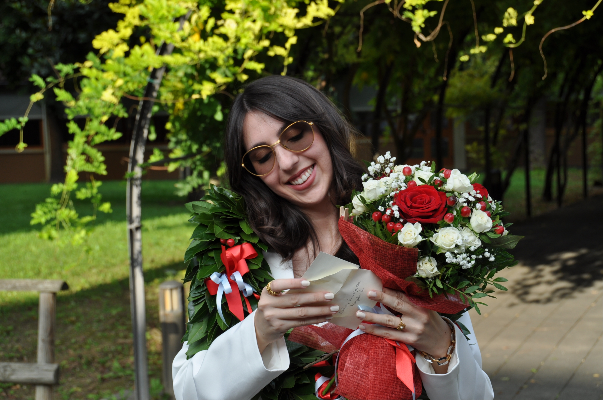

<!-- Main -->

<!-- One -->
<section id="one">
	

		<header class="major">
			<h1>About me</h1>
		</header>
		
{: width="50"}

<!-- Content -->
<h2 id="content">Bio</h2>
I am a PhD student in <b>Statistical Sciences<b> at the <b>University of Padova<b>.

My research interests focus on <b>Time Series modeling and forecasting, Bootstrap techniques<b>, and Stochastic processes, with applications in <b>Econometrics<b> and Social Sciences.

<!-- Research Interests -->
<h2 id="elements">Research Interests</h2>
<ul>
	<li><b>Theory & Methods:<b> Time series modeling and forecasting, Bootstrap techniques, Stochastic processes, Statistical inference, Asymptotic theory.</li>
	<li><b>Applications:<b> Econometrics, State-space models, Social sciences.</li>
</ul>

<!-- Education -->
<h2 id="elements">Education</h2>
<ul>
	<li><b>PhD in Statistical Sciences<b> (11/2024 - Present)
    [cite_start]<i>University of Padova, Italy<i> </li>
	<li><b>Master's degree in Statistical Sciences<b> (09/2022 - 09/2024)
    <i>University of Padova, Italy<i> - 110 e lode (with honors)</li>
    <li><b>Bachelor's degree in Statistics for Economic and Business<b> (09/2019 - 07/2022)
    <i>University of Padova, Italy<i> - 110 e lode (with honors)</li>
</ul>

<!-- Awards -->
<h2 id="elements">Awards</h2>
<ul>
	<li>Second place for <b>"Best Master's thesis in statistical disciplines in memory of Prof. Agostino Tarsitano"<b> - <i>Società Italiana di Statistica (2025)<i></li>
	<li><b>"Mille e una Lode" Excellence Grant<b> - <i>University of Padova (2022)<i>: Scholarship for outstanding academic performance (top 1000 students)</li>
</ul>

<!-- Technical Skills -->
<h2 id="elements">Technical Skills</h2>
<ul>
	<li><b>Advanced:<b> R/RStudio, LaTeX, Microsoft Office Suite</li>
	<li><b>Intermediate:<b> Python, SAS</li>
    <li><b>Basic:<b> SQL, C/C++, Stata </li>
</ul>

